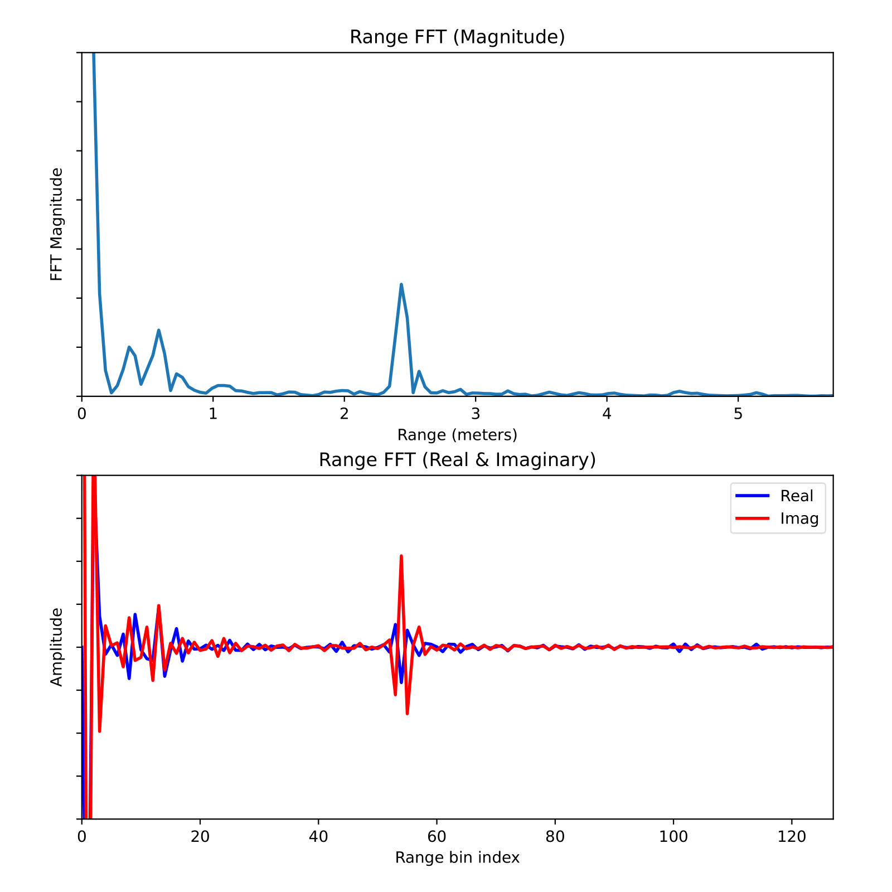

# TI IWRL6432 mmWave Radar Minimum Rangeproc DPU Implementation

## Overview  
This project was developed as part of a university assignment and provides a minimal implementation of radar frontend configuration and Range-FFT calculation using the Texas Instruments [IWRL6432BOOST](https://www.ti.com/tool/IWRL6432BOOST) mmWave radar evaluation module. It is based on TI’s [Motion and Presence Detection Demo](https://dev.ti.com/tirex/explore/node?node=A__AGKSp6XJSIVonQK9nNyYLg__MMWAVE-L-SDK__BHQ90AU__LATEST), which, due to its feature set, is rather extensive and may initially appear complex.

This simplified project removes unnecessary components from the original demo, retaining only the essential SDK functions needed to operate the radar frontend and the first processing stage (Rangeproc DPU) of the FMCW radar signal processing chain. The goal is to provide a better overview of the minimal required function calls and configuration.

It only implements the Rangeproc DPU using the Major Motion mode, yielding a (1D) radar cube for each frame. For demonstration purposes a range profile of one chirp and one (virtual) Rx antenna is transmitted via UART and displayed via a python script.


The project utilizes **MMWAVE-L-SDK version 05.05.03.00**. Download [here](https://www.ti.com/tool/download/MMWAVE-L-SDK).  

<div style="text-align: center;">
  
</div>

### Key Features  

- **Range-FFT calculation via Rangeproc DPU**  
  - Performs Range-FFT calculation on ADC samples via Rangeproc DPU
  - Extracts range bins from one antenna and one chirp
  - Data is streamed via UART to a host application for visualization

- **Minimal standalone implementation**  
  - No CLI-based reconfiguration, all parameters set in `defines.h`
  - Chirp parameters in `defines.h` can easily be generated from a `.cfg` file generated from TI's [mmWave Sensing Estimator](https://dev.ti.com/gallery/view/mmwave/mmWaveSensingEstimator/ver/2.4.0/) using the [chirp_config_to_defines.py](/scripts/chirp_config_to_defines.py) script
  - Only includes necessary SDK function calls for radar frontend and Rangeproc DPU 

- **Further notes**
  - Major Motion mode only
  - Factory calibration data is always restored from flash
  - Task management achieved with FreeRTOS and semaphore synchronization

## Project Structure

```
/minimal_rangeproc_impl
├── src/                         # Source files
├── include/                     # Header files
├── example.syscfg               # configuration file for configuring the MCU drivers
/docs                            # images       
/scripts 
├── chirp_config_to_defines.py   # python script for generating C header from config
├── uart_range_plotter.py        # python script to visualize sent range radar cube data
```

### Project files

Detailed documentation can be found in form of Doxygen comments in the source files, as well as in exported form in the `doxygen/` directory of the repository.

#### **Brief overview of important source files:**


| `/minimal_rangeproc_impl/src/`                  |  |
|-----------------------|-------------|
| [`main.c`](/minimal_rangeproc_impl/src/main.c)             | Initializes hardware, configures the radar sensor, sets up DPUs, and starts FreeRTOS. |
| [`factory_cal.c`](/minimal_rangeproc_impl/src/factory_cal.c)      | Restores and applies factory calibration data from flash memory. |
| [`mem_pool.c`](/minimal_rangeproc_impl/src/mem_pool.c)        | Implements memory pool management functions and data structures. |
| [`mmwave_basic.c`](/minimal_rangeproc_impl/src/mmwave_basic.c)    | Handles mmWave sensor initialization, configuration, and control. |
| [`mmwave_control_config.c`](/minimal_rangeproc_impl/src/mmwave_control_config.c) | Configures chirp and profile settings for TI mmWave radar. |
| [`rangeproc_dpc.c`](/minimal_rangeproc_impl/src/rangeproc_dpc.c)   | Implements the Range Processing DPU (FFT, object detection, UART transmission). |
| [`uart_transmit.c`](/minimal_rangeproc_impl/src/uart_transmit.c)   | Manages UART transmission of radar cube data, synchronized via semaphores. |


| `/minimal_rangeproc_impl/include/`           |  |
|--------------|-------------|
| [`system.h`](./minimal_rangeproc_impl/include/system.h)  | Holds most global handles and configs. |
| [`defines.h`](./minimal_rangeproc_impl/include/defines.h)  | Defines chirp parameters (antenna settings, chirp configurations, timing). Configurations can be generated using the [mmWave Sensing Estimator](https://dev.ti.com/gallery/view/mmwave/mmWaveSensingEstimator/ver/2.4.0/) and the [chirp_config_to_defines.py](/scripts/chirp_config_to_defines.py) script. |

## Known Issue with Linux: Post-Build steps fail
When building the project in CCS Theia, you will likely encounter the following error during the build:
```
...
[96]makefile_ccs_bootimage_gen:65: recipe for target 'all' failed
[97]Traceback (most recent call last):
[98]  File "Integrity_generator.py", line 113, in &lt;module&gt;
[99]  File "Integrity_generator.py", line 33, in generate_integrity_image
[100]  File "Crypto/Protocol/KDF.py", line 322, in HKDF
[101]  File "Crypto/Hash/HMAC.py", line 213, in new
[102]  File "Crypto/Hash/HMAC.py", line 86, in __init__
[103]  File "Crypto/Hash/SHA512.py", line 177, in new
[104]  File "Crypto/Hash/SHA512.py", line 85, in __init__
[105]  File "ctypes/__init__.py", line 387, in __getattr__
[106]  File "ctypes/__init__.py", line 392, in __getitem__
[107]AttributeError: /tmp/_MEIPi3Oht/Crypto/Util/../Hash/_SHA512.cpython-310-x86_64-linux-gnu.so: undefined symbol: SHA512_init
[108][256353] Failed to execute script 'Integrity_generator' due to unhandled exception!
[109]gmake[3]: *** [all] Error 1
[110]makefile:174: recipe for target 'post-build' failed
[111]gmake[2]: [post-build] Error 2 (ignored)
```
This issue [is described here in the TI forum](https://e2e.ti.com/support/sensors-group/sensors/f/sensors-forum/1438989/boot-image-generation-problems). Note that the build does complete as long as you have your Build Configuration set to `Debug`. For me personally the mentioned solution with wine did not work.